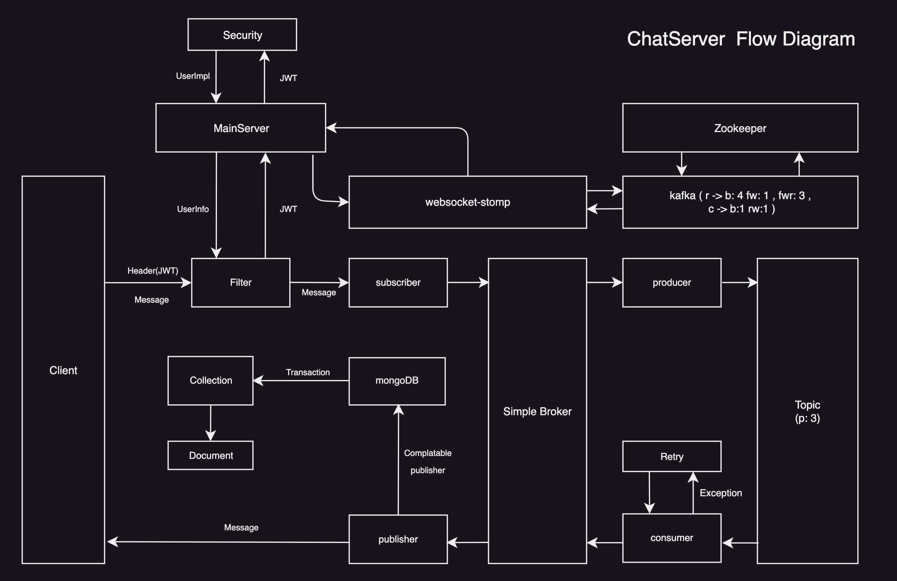
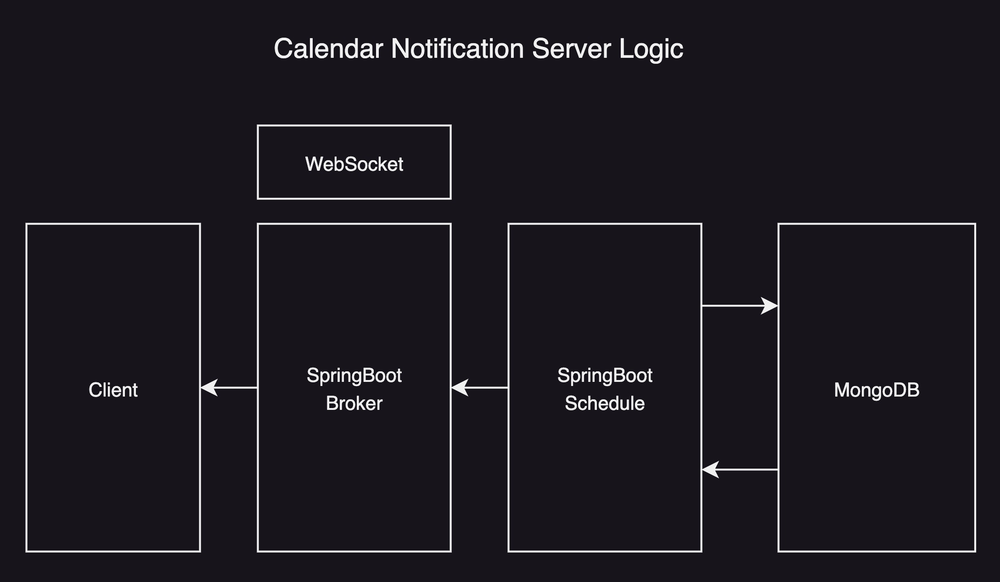

# INFORMATE PROJECT CHATTING SERVER

### 1. STACK

<table>
    <tr>
        <td></td>
        <td></td>
        <td></td>
    </tr>
    <tr>
        <td></td>
        <td></td>
        <td></td>
    </tr>
</table>

1. Framework : SpringBoot, Kafka 
2. db: MongoDB, Oracle
3. WebSocket-STOMP
4. Language : Java

### 2.  Chatting Server Logic Diagram

### 3. Calendar Notification Server Logic Diagram

